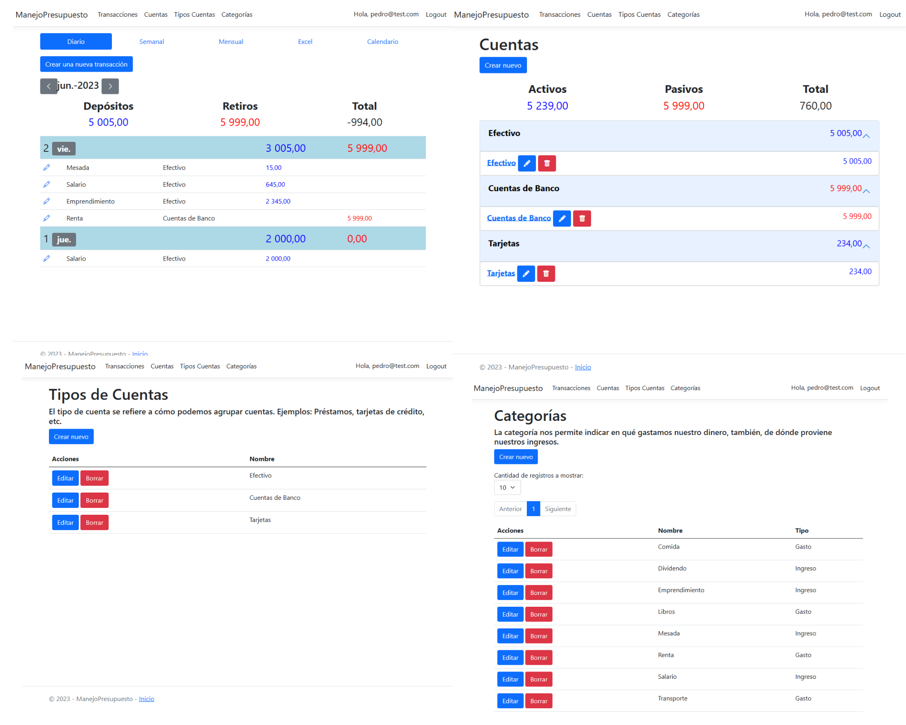

# Manejo de Presupuestos



Este proyecto es una aplicación de manejo de presupuestos elaborada con ASP .NET Core que permite a los usuarios registrar y controlar sus movimientos financieros para tener un mejor conocimiento de sus gastos. A través de esta aplicación, los usuarios podrán ingresar sus transacciones y visualizarlas en un calendario mensual, exportarlas a Excel y utilizar distintos formularios para interactuar con la aplicación.

## Características principales

- Creación de una base de datos en SQL Server utilizando Dapper como ORM para almacenar los datos del sistema.
- Conexión con la base de datos desde la aplicación MVC utilizando Dapper para realizar operaciones de lectura y escritura.
- Ejecución de queries y procedimientos almacenados desde MVC utilizando Dapper para gestionar los datos de manera eficiente.
- Diseño de formularios con diferentes tipos de controles, como texto, select (dropdown), checkbox, selector de fechas, entre otros.
- Implementación de un sistema CRUD (Crear, Leer, Actualizar, Eliminar) utilizando Dapper para administrar diferentes entidades en la aplicación.
- Aplicación del principio de inversión de dependencias para lograr un software flexible y fácilmente mantenible.
- Aislamiento de CSS para mejorar la organización y la legibilidad del código.
- Calendario interactivo que permite a los usuarios visualizar rápidamente sus transacciones distribuidas a lo largo del mes.
- Funcionalidad para exportar las transacciones a Excel utilizando Dapper, brindando a los usuarios una forma conveniente de analizar y compartir sus datos.
- Construcción de un sistema de usuarios utilizando una tabla propia de usuarios para gestionar el acceso y la seguridad de la aplicación.

## Requisitos previos

Antes de utilizar esta aplicación, asegúrate de tener instalados los siguientes componentes:

- [SQL Server](https://www.microsoft.com/en-us/sql-server/sql-server-downloads)
- [Visual Studio 2022](https://visualstudio.microsoft.com/es/vs/)
- [SQL Server Management Studio](https://learn.microsoft.com/en-us/sql/ssms/download-sql-server-management-studio-ssms?view=sql-server-ver16)

## Instalación y configuración

1. Clona este repositorio en tu máquina local utilizando el siguiente comando:

   ```
   git clone https://github.com/tu_usuario/nombre_del_repositorio.git
   ```

2. Abre el proyecto en Visual Studio 2022.

3. Ejecuta el script adjunto en el repositorio llamado "ManejoPresupuesto.sql" que generará la base datos, tablas y procedimientos almacenados en SQL Server Management Studio.

4. En el archivo `appsettings.json`, actualiza la cadena de conexión (`ConnectionStrings`) con los detalles de la base de datos SQL Server y el nombre de tu **Server**.

   ```json
   "ConnectionStrings": {
     "DefaultConnection": "Server=nombre_del_servidor;Database=ManejoPresupuesto;Integrated Security=True;TrustServerCertificate=Yes"
   }
   ```

5. Configura tu IDE para compilar y ejecutar la aplicación.

## Uso

1. Inicia la aplicación desde tu IDE.

2. Accede a la aplicación a través de tu navegador web.

3. Regístrate como nuevo usuario o inicia sesión si ya tienes una cuenta.

4. Una vez autenticado, podrás ingresar tus movimientos financieros utilizando los formularios disponibles.

5. Explora las distintas secciones de la aplicación, como el calendario y la exportación a Excel, para aprovechar al máximo las funcionalidades ofrecidas.
